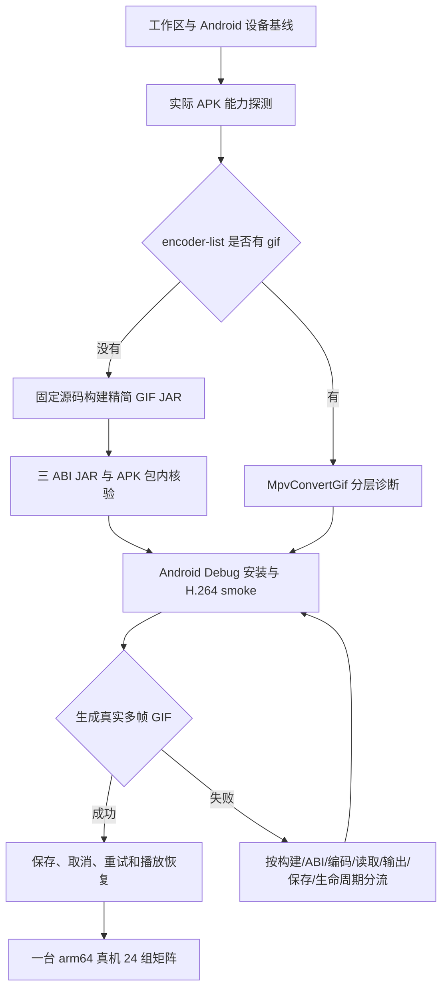

# Android GIF 导出调试与修复执行手册

> 状态：GIF-only 三 ABI JAR 已在本机生成并完成静态审计，最终三 ABI Release APK 已集成；Pixel 10 API 37 arm64 模拟器已完成 ExPiliPlus UI 导出、MediaStore 保存、取消、重试和播放恢复验收；用户已确认当前版本可在真实 Android 设备导出 GIF；详细真机矩阵与远端 Linux CI 记录仍待补充<br>
> 记录日期：2026-08-23<br>
> 更新日期：2026-08-24<br>
> 适用版本：`1.0.0-dev.1`；`main@a53ab7d4a` 加当前工作区既有未提交修改<br>
> 范围：Android arm64 真机的播放器 GIF 生成、保存、取消、重试和播放状态恢复；保留三 ABI 构建检查；不包含 iOS/macOS 已完成路线、Windows/Linux GIF 回归、HEVC、AV1、直播、DRM、整轨下载回退、后台导出、编辑和新的用户交互

## 1. 当前结论

本记录是 Android GIF 导出的方案与调试手册。本轮完成 Android H.264 源筛选、GIF 输出结构校验、脱敏运行诊断、本地 Android Flutter 包、GIF-only 原生构建、许可证留档、最终三 ABI Release APK 构建和模拟器安装启动，并加入固定源码构建脚本、补丁、许可证清单和手动触发的 Linux CI 工作流。官方 `encoders-gpl` 候选 JAR 已通过三 ABI ZIP、native 库和 `ff_gif_encoder`/`ff_gif_muxer` 静态检查，确认候选库确实有用，但它包含完整 GPL 编码器和 x264，不作为最终产物。最终 GIF-only JAR 已由固定源码和补丁在本机完成 native 编译，并在 APK 包内确认 GIF symbols 存在、x264 markers 不存在；使用实际 `media_kit_libs_android_video` Java 插件注册的 app-level harness 已在 Pixel 10 arm64 模拟器生成并解析真实多帧 GIF，24 组参数最终全部成功（其中 1 组首次等待超时后单独重试成功）。最终 ExPiliPlus 播放器 UI 已在同一模拟器实际触达 GIF 面板，完成一次保存和一次重试保存，拉回的两个 GIF 均可被 FFmpeg 解码，MediaSession 在导出结束后为 PLAYING；用户随后确认当前版本在真实 Android 设备上可以导出 GIF。用户未提供设备型号、ABI、逐项文件或完整真机矩阵日志，因此这些细节不在本记录中推断；远端 Linux CI 也尚未运行。

当前 Android 仍由 `MpvConvertGif` 进入 libmpv 的 GIF 输出选项。项目锁定的 Android 视频库来自 `My-Responsitories/media-kit`，其构建脚本下载 `bggRGjQaUbCoE/libmpv-android-video-build` 的 `vnext` 默认 JAR。对应的 baseline libmpv 构建先关闭 muxer/encoder，再只白名单 PNG、WebP 等能力，没有 GIF encoder/muxer；临时 native smoke 还确认当前 mpv 版本的输出视频编码器必须直接使用 `ovc=gif`，使用旧的 `ovc=lavc` 会报 `codec 'lavc' not found`。结论必须在 GIF-only APK 运行时用 `encoder-list` 和一次真实 smoke 再确认，不能只凭文件名或错误提示判断。[固定构建源码](https://github.com/bggRGjQaUbCoE/libmpv-android-video-build/blob/0bb77586769b9e882123197ef8dc940bae5de8b2/buildscripts/flavors/default.sh)

首选路线是在 ExPiliPlus 内维护可复建、可审计的三 ABI 精简 GIF libmpv JAR，只增加 GIF encoder 和 GIF muxer，保持 `--disable-gpl`、`--disable-nonfree`，继续复用 `MpvConvertGif`。如果运行证据显示问题不在编码能力，则按故障树修复最小层；不得因为“转码失败或已取消”直接扩大到下载回退、GPL 全编码构建或 Android 原生媒体管线。

## 2. 背景与任务范围

### 2.1 要解决的问题

播放器已有 GIF 入口、预览、范围、时长、分辨率和 FPS 控件。当前参数为 3/5/8/10 秒、480p/720p、10/12/15 FPS、无音频、无限循环和 `.gif` 文件名。iOS 27 与 macOS 已完成原生 GIF 导出；Windows 和 Linux 已放弃 GIF 导出，不在本任务回归范围。

Android 当前导出显示“转码失败或已取消”。需要让 Android 真机完成真实 GIF 生成和保存，并能以日志和文件证据区分构建、ABI、编码能力、媒体读取、输出、保存和生命周期故障。

### 2.2 不解决的问题

- 不改变现有 GIF UI、参数、文件名、无音频、无限循环或保存语义。
- 首轮只接受普通 H.264（`avc1`）点播源；不扩大到 HEVC、AV1、直播或 DRM。
- 不修改 iOS/macOS Darwin 原生转换器，不修复 Windows/Linux GIF 导出。
- 不引入独立 `ffmpeg`、整轨下载、后台任务、并发导出或新的用户可见设置。
- 不提高 Android `minSdk 24`，不清除或覆盖用户正式版应用数据。
- 不把静态代码、模拟器、默认 JAR 的字符串或本地工具 smoke 单独写成 Android 真机通过。

## 3. 依据与现状

| 类型 | 结论 | 依据 |
| --- | --- | --- |
| 已确认 | Android 和其他非 Darwin 平台选择 `MpvConvertGif`，iOS/macOS 选择 `DarwinGifConverter`。 | `lib/plugin/pl_player/widgets/gif_converter.dart:8-36` |
| 已实现 | Android GIF 转换使用 `of=gif`、`ofopts=loop=0`、`ovc=gif`、`vf=fps/scale`、`audio=no` 和 headless `vo=null`；删除了在当前 mpv 版本中错误的 `ovc=lavc`/`ovcopts=codec=gif` 组合。 | `lib/plugin/pl_player/widgets/mpv_convert_gif.dart:48-69`；候选 native 模拟器 smoke |
| 已确认（修复前） | Android GIF 入口原先没有像 Darwin 路线一样限制 `avc1`，会从有 `baseUrl` 的 DASH 视频候选中选择源。 | `lib/plugin/pl_player/view/view.dart:2118-2156`；本轮已按下一行修复 |
| 已实现 | Android GIF 按钮已恢复到全屏播放器控制栏；Android 首轮候选现在与 Darwin 一样只接受 `video.codecs.startsWith('avc1')`；没有符合条件的源仍使用现有不可用提示。 | `lib/plugin/pl_player/view/view.dart:1870-1905`、`lib/plugin/pl_player/view/view.dart:2128-2137` |
| 已确认 | 导出前暂停当前播放，转换完成后在 `finally` 清理临时文件并恢复原播放状态；保存通过 `ImageUtils.saveFileImg`。 | `lib/plugin/pl_player/view/view.dart:2158-2230` |
| 已实现 | 转换成功现在还要求 GIF 文件完整结束、至少两帧和无限循环扩展；失败或取消仍删除输出。 | `lib/plugin/pl_player/widgets/gif_file_validator.dart`；`lib/plugin/pl_player/widgets/mpv_convert_gif.dart:161-190` |
| 已实现 | 针对当前 Android mpv GIF muxer 在结束时截断最后一帧或遗漏 Trailer 的行为，校验器会保留已完成帧、丢弃不完整尾帧，并补写标准 `NETSCAPE2.0` 无限循环扩展与 GIF Trailer；不重新编码。 | `lib/plugin/pl_player/widgets/gif_file_validator.dart`；`test/plugin/pl_player/widgets/gif_file_validator_test.dart`；最终 UI 日志 `loopRepair` |
| 已实现 | Android 初始化时记录 mpv/FFmpeg 版本、GIF encoder 存在性、配置相关摘要和输出选项；URL、完整本地路径和错误中的敏感路径被脱敏。 | `lib/plugin/pl_player/widgets/mpv_convert_gif.dart:251-342` |
| 已确认 | Android 保存使用 `SaverGallery.saveFile`，Android 10 以上通过 MediaStore 写入 `Pictures/ExPiliplus`，GIF 文件字节由插件直接复制。 | `lib/utils/image_utils.dart:300-355`；当前 `saver_gallery` Android 实现 |
| 已实现、GIF-only 产物已集成 | Android 视频库已通过本地 `third_party/media_kit_libs_android_video` 包覆盖；`pubspec.lock` 来源为 path。包内使用 SHA-256、源码提交、GIF-only metadata、native GIF symbols 和无 libx264 symbols 校验；没有 artifact 或提供 baseline metadata 时会 fail-closed，不再静默回退。 | `pubspec.yaml:185-192`；`pubspec.lock:1113-1120`；`third_party/media_kit_libs_android_video/android/build.gradle`；`third_party/media_kit_libs_android_video/README.md`；`third_party/android-gif-libmpv/artifacts/build-metadata.txt` |
| 已确认 | 当前依赖的 Android 构建脚本以 default flavor 关闭所有 encoder/muxer，再白名单 WebP 等能力；源码固定提交为 `0bb77586769b9e882123197ef8dc940bae5de8b2`，default JAR 支持 `arm64-v8a`、`armeabi-v7a`、`x86_64`。 | 当前依赖构建脚本；固定构建源码 `default.sh` |
| 已确认 | 当前 default JAR 三 ABI 的 SHA-256 为 `arm64-v8a=2c67bc2e...eff1e`、`armeabi-v7a=2ba89da4...2984`、`x86_64=40a98649...58df`；这些是 playback baseline，不能作为 GIF 能力证据。 | `/tmp/expiliplus-android-gif-baseline.LLkYll`；本地包 `android/build.gradle`；JAR `unzip -l` |
| 已确认 | Flutter 版本为 3.44.8，Android SDK 为 36，Android Studio 位于 `/Applications/Android Studio.app`；`Pixel_10` 模拟器为 Android API 37、`arm64-v8a`。用户已确认当前版本在真实 Android 设备上可以导出 GIF，但没有提供设备型号、ABI 或逐项运行日志。 | Flutter/Android 工具输出；`adb shell getprop`；用户真机验证反馈 |
| 已确认 | 当前工作区存在用户已有的 iOS、音频、本地化、macOS 配置和其他未提交修改；本手册不得将这些修改归因于 Android GIF 任务。 | 本轮开始前 `git status --short` |
| 已确认候选库有用 | 官方 `encoders-gpl` 三 ABI JAR 均为有效 ZIP，包含对应 ABI 的 `libmpv.so`，并包含 `ff_gif_encoder` 与 `ff_gif_muxer`；该 flavor 不能作为最终产物，因为它同时启用完整 encoder 集合和 x264。 | `/tmp/expiliplus-gif-candidate-v1.1.11`；`unzip -t`、`unzip -l`、`strings`、SHA-256 | 已完成静态确认；仍需用 GIF-only APK 做运行时导出验收 |
| 已实现、产物已本地验证 | 已加入 `third_party/android-gif-libmpv/enable-gif.patch`、`lib/scripts/build_android_gif_libmpv.sh` 和 `.github/workflows/android-gif-libmpv.yml`；脚本固定源码提交并只增加 `gif` encoder/muxer，复制 JAR 前强制检查 `CONFIG_GIF_ENCODER=1`、`CONFIG_GIF_MUXER=1`、GIF native symbols 和无 libx264 symbols；工作流还会检查 JAR、APK 内的 GIF symbols 并上传哈希、日志、源码许可证和依赖许可证清单。 | 本轮新增文件；固定源码本机 native build、三 ABI JAR ZIP/symbol/hash 审计、许可证清单、APK 包内审计和 Gradle fail-closed 检查通过；远端工作流未触发 |
| 已确认 GIF-only APK 包内能力 | 最终 Release APK 构建号 5191、包名 `io.github.sanshanhyo.expiliplus`、约 71.0 MB；三 ABI 各含 `libmpv.so`，并且 `ff_gif_encoder`、`ff_gif_muxer` 存在，x264 markers 不存在。 | `build/app/outputs/flutter-apk/app-release.apk`；`aapt dump badging`；`unzip -l`、`unzip -p | strings`；`adb install -r` |

## 4. 技术路线与决策树



### 4.1 环境与证据基线

每次 `/goal` 开始和结束都记录以下内容，并与开始前的工作区状态比较：

```bash
pwd
git rev-parse --short HEAD
git status --short
git diff --name-only
git diff --check
/Users/husky/Developer/sdk/flutter/bin/flutter --version
/Users/husky/Developer/sdk/flutter/bin/flutter doctor -v
/Users/husky/Library/Android/sdk/platform-tools/adb devices -l
/Users/husky/Library/Android/sdk/platform-tools/adb shell getprop ro.product.model
/Users/husky/Library/Android/sdk/platform-tools/adb shell getprop ro.build.version.sdk
/Users/husky/Library/Android/sdk/platform-tools/adb shell getprop ro.product.cpu.abilist
```

没有连接真机时，可以使用 Android Studio/Pixel 10 模拟器完成构建、安装、通道和 Logcat smoke，但必须把它标记为辅助证据。真机连接后重新记录型号、API、ABI、应用包名和 Debug/Release 构建信息。

### 4.2 实际 APK 的能力探测

1. 先从当前 APK 或 Debug 安装包解出三 ABI 的 `libmpv.so`，记录架构、文件大小和 SHA-256；不从 `.pub-cache` 或旧构建目录推断最终包能力。
2. 在当前 `MpvConvertGif` 的 native client 实例上读取并脱敏记录 `mpv-version`、`ffmpeg-version`、`mpv-configuration` 和 `encoder-list`。能力结论必须来自实际 APK 运行时。
3. 记录 `of=gif`、`ovc=gif` 的 option/command 返回值，再观察 `FILE_LOADED`、日志错误、`END_FILE`、输出存在性、字节数和 GIF 文件头。
4. 日志只保留阶段、协议/主机、错误域/错误码、耗时、帧序号、文件大小、文件头、ABI 和 JAR/APK 哈希。完整 URL、查询签名、Cookie、User-Agent、Referer、账号、设备序列号和包含用户名的本地路径必须删除或遮盖。
5. 如果 `gif` encoder/muxer 缺失，停止继续盲调 `vo`、硬解、滤镜或取消时序，进入精简 JAR 构建；如果能力存在，直接按第 4.4 节分层诊断。

### 4.3 精简 GIF JAR 构建与本地交付

1. 固定源码为 `libmpv-android-video-build@0bb77586769b9e882123197ef8dc940bae5de8b2`，保存源码提交、FFmpeg/mpv/NDK 版本、构建参数和许可证清单。
2. 从 default flavor 复制或补丁化构建步骤，只增加：
   - `--enable-muxer=gif`
   - `--enable-encoder=gif`
3. 保持 `--disable-gpl`、`--disable-nonfree`，不启用 `encoders-gpl`、x264 或全部 encoder/muxer。只有构建日志明确显示 `gif` encoder/muxer 已启用，才进入 APK 集成。
4. 固定源码构建脚本和手动 Linux CI 均生成 `arm64-v8a`、`armeabi-v7a`、`x86_64` 三个 JAR。2026-08-24 已在本机复用 Android SDK 完成 native build，并完成本地 artifact 打包、元数据、许可证清单和 Release APK 集成；本机上游 bundle 的 macOS 辅助步骤需要宿主 SDK/工具链兼容处理，CI 仍保留为可复建路径。当前工作流只允许手动触发；本轮没有提交、推送或触发远端工作流。
5. 已在 ExPiliPlus 内建立本地 `third_party/media_kit_libs_android_video` Flutter 包，替代 `media_kit_libs_android_video` 的 Android 依赖覆盖。当前包只接受固定源码构建脚本生成的 GIF-only JAR、SHA-256、文件大小和许可证边界，不得直接改 `.pub-cache` 或回退 baseline。
6. `flutter pub get` 后已检查 `pubspec.lock` 的 path 来源、最终 Release APK 内每个发布 ABI 只有一个 `libmpv.so`，并完成模拟器安装/启动 smoke；最终 APK 的 GIF symbols 和 x264 排除已通过。app UI 的真实 H.264 GIF smoke、保存和生命周期已在 Pixel 10 模拟器完成；仍需在 arm64 真机重复这些证据。

如果构建需要 GPL 全编码、外部依赖仓库修改、独立 `ffmpeg`、新增下载回退、改变最低 Android 版本或无法提供可审计许可证，停止 `/goal` 并询问项目负责人。

### 4.4 Android Dart 层与转换生命周期

1. `showGifRecorder` 将 Android 首轮候选限制为 `video.codecs.startsWith('avc1')`，没有符合条件的源时继续使用现有“暂无可用源”提示；不改变普通播放。
2. 保持 `GifConverter` 的 `convert()`/`dispose()` 契约和当前 UI 参数。Android 继续使用 `MpvConvertGif`，不新增公开 API 或 MethodChannel。
3. 增加 Android 专用运行时能力摘要、option 返回值和脱敏失败摘要，区分初始化、能力、加载、编码、输出和结束原因；不得记录敏感 URL 或完整本地路径。
4. 成功判定必须同时满足：正常 EOF、无 mpv error、输出存在且非空、`GIF87a`/`GIF89a` 文件头、GIF 结构完整、至少两帧和无限循环标记。若 Android mpv 在最后一帧收尾时产生可识别的截断尾帧，先保留已完成帧并补齐 GIF 封装，再执行同一成功判定；失败、取消和异常都删除临时文件。
5. 取消必须终止同一个转换会话，等待原始 Future 收尾，避免 `busy`、残留文件和无法重试；`finally` 中恢复导出前播放/暂停状态。
6. 保存继续复用 `ImageUtils.saveFileImg` 和 SaverGallery/MediaStore。保存成功、保存失败和保存面板取消都必须与转换成功状态分开记录，不能误报“已保存”。

## 5. Computer Use 自我调试授权

后续 `/goal` 在用户授权的本机环境支持时，可以使用 Computer Use 操作：

- Android Studio、Device Manager、Running Devices 和 Logcat；
- 并行安装的 ExPiliPlus `.debug` 应用、播放器、视频页面、GIF 入口、预览和参数控件；
- Android 系统文件/相册查看界面，用于确认 GIF 文件存在、尺寸、帧数、动画播放和保存位置。

操作规范：

1. 优先读取无障碍状态；每次点击、输入、滚动或拖动后重新读取最新状态，不复用过期元素索引。
2. 无障碍树不足时才使用截图和坐标；截图不得写入包含账号、完整 URL、Cookie 或设备标识的工程日志。
3. 现有正式应用只作基线，不卸载、不覆盖、不清除数据。修改后的构建优先使用 `.debug` 包并行安装。
4. 登录、验证码、账号异常、系统隐私/安全授权、未知来源安装和敏感设置必须暂停并交还用户。Codex 不读取或输入凭据，不保存敏感截图。
5. 用户选择普通线上视频，要求至少 15 秒、可确认存在 H.264 源、不是直播或 DRM。用户没有接管前，不把登录态或设备行为写入工程记录。
6. Computer Use 只能用于图形界面验证；构建、ADB、Logcat、哈希和文件结构检查优先使用可重复命令。官方能力和权限边界见 [Computer Use 官方说明](https://learn.chatgpt.com/docs/computer-use)。

## 6. 分层故障树

| 症状/证据 | 首先检查 | 允许的最小修改 | 停止条件 |
| --- | --- | --- | --- |
| APK 安装失败或应用无法启动 | 包名、签名、ABI、APK 内 native 库、Debug 与正式版是否冲突 | 修本任务内的本地依赖打包或 Debug 安装配置 | 需要卸载/清数据、改变正式签名或修改无关 Android 配置 |
| native 库加载失败 | `abiFilters`、APK `lib/<abi>`、`libmpv.so` 哈希、NDK/运行时依赖 | 修 JAR 打包和本地插件包，补包内检查 | 需要减少现有 ABI 或改变 minSdk |
| `encoder-list` 没有 `gif` | 实际 APK 使用的 JAR、构建提交、构建日志和 SHA-256 | 修精简 flavor 构建与依赖覆盖 | 需要 GPL 全编码、外部依赖仓库或未锁定二进制 |
| 有 `gif` 但没有 `FILE_LOADED` | H.264 `baseUrl`/备用 URL、Header、重定向、DASH 时间范围和真实网络响应 | 修 Android 现有 URL 选择、Header 或时间边界 | 需要整轨下载、改变第三方接口或扩大编码范围 |
| 已加载但编码失败 | option 返回值、GIF muxer、`vf`、硬解继承、native 日志和结束错误 | 依据证据修现有 mpv 参数/生命周期并补测试 | 需要独立 ffmpeg、GPL 路线或新媒体依赖 |
| 生成文件但 GIF 无效 | 文件头、GIF 块结构、帧数、loop 标记、输出 finalize | 修成功判定、输出探测和清理 | 需要改变 GIF 格式或保存语义 |
| 转换成功但相册保存失败 | SaverGallery 返回值、MediaStore MIME、权限、文件字节和目标路径 | 修保存结果传播、MIME/路径和临时文件收尾 | 需要新保存/分享依赖或系统权限策略改变 |
| 取消后 `busy`、残留或无法重试 | 同一个 Future、`dispose`、mpv terminate、`finally` 和播放恢复 | 修单会话、取消收尾和状态恢复 | 需要后台任务或并发导出产品决定 |

任何阶段如需扩大产品语义、读取敏感信息、操作正式应用数据、修改两个依赖仓库、提交/推送/发布或触发远端工作流，都必须暂停并向项目负责人确认。

## 7. 验证记录

| 层级 | 命令/平台/输入 | 预期 | 实际 | 结果 |
| --- | --- | --- | --- | --- |
| 工作区 | `git status --short`、`git diff --check` | 保留任务前已有修改；本轮只改 Android GIF 相关源码、测试和本手册 | 既有 iOS、音频、本地化、macOS 修改未被覆盖；`git diff --check` 通过 | 已完成 |
| 文档 | `git check-ignore -v docs/engineering/android-gif-export-debugging.md`；直接检查文档空白错误 | 文档按本地工程记录规则被忽略，元信息/更新记录完整 | `docs/` 由 `.gitignore:156` 忽略；本手册直接检查 | 已完成 |
| 依赖来源 | 固定源码提交、构建参数、三 JAR SHA-256、许可证 | 三 ABI GIF-only 产物可复建且来源可追溯 | 固定提交 `0bb77586769b9e882123197ef8dc940bae5de8b2`、GIF 补丁 SHA-256 `7dd5b08a7a215164ae55ab05b98e248ac22d379dcc5f43e1758adc993f8c75d4`、构建元数据和 62 项许可证清单已落盘；三枚 JAR 已通过 ZIP、GIF symbols、无 x264 markers、哈希和大小校验；Gradle 已验证缺少 artifact、baseline metadata 或含 x264 的候选 JAR 时拒绝构建 | 已完成本地审计；远端可复建工作流待执行 |
| 固定构建入口 | `bash -n lib/scripts/build_android_gif_libmpv.sh`；固定源码目录中的 `git apply --check` | 脚本和 GIF 补丁可被 Linux CI 使用 | 脚本语法检查、工作流 YAML 解析、GIF 补丁和 `local-build-compat.patch` 对固定 `vnext` 提交的应用检查通过；入口脚本已为 clean checkout 准备 ignored 路径、复用 macOS 本地 SDK，并在临时上游 checkout 中去除 bundle 的隐式 sudo/目录判断问题；本机完整复建本次仍被上游 mbedtls 网络 clone 中断，最终 JAR 来自同一固定源码/补丁的本机 native build，远端 Linux CI 尚未执行 | 已完成静态/本地构建；CI 待执行 |
| APK 包内检查 | `flutter build apk --release --target-platform android-arm64,android-arm,android-x64 --build-number=5191`；Release APK、`unzip -l`、ABI 与 `libmpv.so` symbols | 每个发布 ABI 只有一个 GIF-only native 库 | 最终包 `io.github.sanshanhyo.expiliplus` 构建成功，71.0 MB；`arm64-v8a` 14,499,728 bytes、`armeabi-v7a` 12,908,836 bytes、`x86_64` 17,812,768 bytes 的 `libmpv.so` 均含 GIF symbols 且无 x264 markers；`compileSdkVersion=36`；APK SHA-256 `7221f6e6cfb619a42e9dae45b6e1d256dd3b33cbdaa8b87362b6ca5740f2330e` | 已完成 |
| Dart 静态/自动化 | Flutter analyze、定向测试、全量测试 | 无新增 error，相关测试通过 | 定向测试 2/2；全量 Flutter 测试 81/81；定向分析无问题；全量分析 70 条既有 info、无 error | 已完成 |
| 模拟器 smoke | Pixel 10 Android 17 arm64，Debug 包 | 安装、启动、生命周期回前台和 native load 无崩溃 | 2026-08-24 重新执行：`adb install -r` 成功；包 `io.github.sanshanhyo.expiliplus.debug` 启动到 `com.example.piliplus.MainActivity`；退后台再恢复后进程仍在；logcat 显示 arm64 `libmpv.so` load ok，未见 `FATAL EXCEPTION`、`UnsatisfiedLinkError` 或 `SIGSEGV`。此项只是 baseline 辅助 evidence | 已完成辅助 smoke |
| 候选 native GIF smoke | Pixel 10 API 37 arm64；本地 3 秒 H.264、候选 `encoders-gpl` arm64 `libmpv.so`、临时 libmpv harness | 真实输出 GIF 并通过结构校验 | `ovc=lavc` 失败并返回 `codec 'lavc' not found`；改为 `ovc=gif` 后 `rc=0`，输出 `GIF89a`、160x90、10 FPS、29 帧、117953 bytes；Dart 校验器报告 `complete=true`、`loop=true`、`valid=true`。候选库不是最终 GIF-only 产物 | 已完成候选库辅助证据 |
| GIF-only native build | 本机 macOS；固定源码提交、GIF 补丁、Android SDK/NDK/CMake；四 ABI native 编译，三发布 ABI JAR 打包 | GIF encoder/muxer 可从固定源码构建，且发布 JAR 不含 x264 | FFmpeg `_build*` 配置均有 `CONFIG_GIF_ENCODER=1`、`CONFIG_GIF_MUXER=1`；发布 JAR：`arm64-v8a` 6,800,083 bytes / `ab166504...802d03`，`armeabi-v7a` 6,406,169 bytes / `147adfaa...3d017`，`x86_64` 7,588,221 bytes / `6f165776...b4a5b`；三者 ZIP、GIF symbols、x264 排除和许可证清单校验通过 | 已完成本地构建/静态证据 |
| GIF-only APK 集成 | `flutter build apk --release --target-platform android-arm64,android-arm,android-x64 --build-number=5191`、`io.github.sanshanhyo.expiliplus`、Pixel 10 API 37 arm64 | 最终 APK 实际打包 GIF-only native 库并可启动 | 最终三 ABI Release APK 安装成功并进入 `com.example.piliplus.MainActivity`；最终包重新安装后的 PID 为 `12384`，arm64 `libmpv.so` load ok，`media_kit_libs_android_video` 注册成功，未见 `FATAL EXCEPTION`、`UnsatisfiedLinkError` 或 `SIGSEGV` | 已完成包内/启动辅助验证 |
| 最终 native app-level GIF smoke | 独立 Flutter harness APK；实际注册 `media_kit_libs_android_video` Java 插件；最终 GIF-only JAR；本地 10 秒 H.264 样片 | app 层实际完成 GIF 文件生成并通过结构校验 | Pixel 10 API 37 arm64：`media_kit` 插件注册、`Initializer.create`、`loadfile` 和 GIF muxer 均成功；输出 218873 bytes，`GIF89a`，30 帧，`trailer=true`，`loop=true`，`end=0`，`error=0` | 已完成模拟器 app-level evidence；不是 ExPiliPlus UI/真机验收 |
| ExPiliPlus Android UI 入口与导出 | 最终 Release APK `io.github.sanshanhyo.expiliplus`；Pixel 10 API 37 arm64；`BV1Kyuj6SE9o`；公开 VOD 播放页；全屏控制栏 | 可从播放器触达“截取 GIF”并保存有效 GIF | 2026-08-24：真实播放成功、竖向上滑进入横屏全屏；无障碍树确认“截取 GIF”、参数面板确认 720p/12 FPS/无限循环；首次 UI 导出日志 `success=true`，保存至 `Pictures/ExPiliplus` 的 GIF 为 23,284,142 bytes、GIF89a、768×480、148 帧、4.97 秒，`ffmpeg` 解码无错误且包含 `NETSCAPE2.0`；日志和 UI 均未记录完整 URL；最终 APK 的运行诊断只记录候选数量和封装状态 | 已完成模拟器 UI 导出/保存证据；不替代真机 |
| 真机基线 | 一台 Android 真机；至少完成一次当前版本 GIF 导出 | 真实多帧 GIF 可导出 | 用户确认当前版本在真机上可以导出 GIF；本轮未取得设备型号、ABI、文件哈希、保存位置或播放恢复日志 | 已由用户确认基础导出 |
| 模拟器 GIF 矩阵 | Pixel 10 API 37 arm64；3/5/8/10 秒 × 480p/720p × 10/12/15 FPS；最终 GIF-only JAR；本地 H.264 样片 | 24 组均生成有效多帧 GIF | 24/24 最终通过 app-level GIF parser：3 秒均 45 帧/849224 bytes，5 秒均 75 帧/1397027 bytes，8 秒均 120 帧/2253136 bytes，10 秒均 150 帧/2809013 bytes；所有最终结果均为 `GIF89a`、`trailer=true`、`loop=true`、`end=0`、`error=0`。`8s/480p/15fps` 首次 20 秒等待超时，单项重试成功 | 已完成模拟器辅助矩阵；不是同一真机矩阵 |
| 真机矩阵 | 一台 arm64 Android 真机；同上 24 组 | 24 组均生成有效多帧 GIF 并能播放 | 尚未执行 | 待验证 |
| 生命周期 | 参数面板取消、成功保存、连续重试、播放/暂停前置状态 | 无残留、无 `busy`、可重试且恢复原状态 | 参数面板“取消”已验证后回到播放；成功导出后第二次 UI 重试再次 `success=true`，生成第二个 GIF（23,145,666 bytes、147 帧、4.93 秒）；导出结束后 `dumpsys media_session` 为 `state=PLAYING`，进程仍存活。当前 SaverGallery 直接写 MediaStore，没有独立“保存面板”，因此没有单独的保存面板取消动作可测；两次文件均位于 `Pictures/ExPiliplus` | 已完成模拟器生命周期/重试证据；真机待验证 |

## 8. 完成门槛与遗留问题

只有以下条件全部满足，才能把状态更新为“Android arm64 真机 GIF 实机验收通过”：

- 三 ABI 精简 JAR 的源码提交、构建参数、SHA-256、许可证和包体积差异已记录。
- 最终 APK/plugin harness 实际加载的 `libmpv.so` 返回 GIF encoder/muxer，普通 H.264 smoke 生成有效 GIF；ExPiliPlus UI 路径已在模拟器单独确认。
- 一台 arm64 真机完成基线、保存、相册动画、取消、保存取消、重试和播放状态恢复。
- 同一真机完成 24 组时长/分辨率/FPS 矩阵，逐组记录文件头、尺寸、帧数、loop 标记、文件大小和动画播放结果。
- 三 ABI 构建/包内检查、依赖解析、定向测试、全量测试、静态分析和文档检查均有实际命令与结果。
- 日志和文档不包含完整 URL、查询签名、Cookie、账号、设备标识或用户名路径，既有工作区修改未被覆盖。

当前遗留问题：

| 问题 | 影响 | 下一步 | 前置条件 |
| --- | --- | --- | --- |
| 真机详细矩阵未留存 | 已确认真实设备基础导出可用，但无法从当前对话还原设备 ABI、相册动画、性能和 24 组逐项结果 | 如需完整审计，再补充设备信息、文件证据和 24 组矩阵 | 需要设备日志或逐项测试记录 |
| 远端 Linux 可复建产物尚未执行 | 当前本地 JAR 已完成静态审计，但尚无 CI 运行记录 | 如需独立复建证据，再手动运行 workflow 并比对产物、许可证和 APK 包内 symbols | 需要远端 workflow 运行权限 |

若直读 H.264、备用 URL、Header、GIF encoder/muxer、输出和生命周期证据仍不足以定位问题，保持“待验证/阻塞”状态并请项目负责人确认，不自行加入下载回退、GPL 全编码、HEVC/AV1 或 Android 原生媒体管线。

## 9. 更新记录

- 2026-08-23：完成 Android 首轮 `avc1` 源筛选、GIF 完整性/至少两帧/无限循环校验、运行能力摘要和日志脱敏；新增定向测试并通过全量 Flutter 测试。核对 default JAR 时发现远端产物与缓存 MD5 校验值漂移；新增固定提交的 GIF encoder/muxer 补丁、三 ABI 构建脚本和手动 Linux CI 工作流。
- 2026-08-24：建立本地 `third_party/media_kit_libs_android_video` 包并将依赖覆盖切换为 path；增加 SHA-256 校验和本地 artifact 目录入口。完成 Flutter APK baseline 构建，确认 APK 内三 ABI 的 `libmpv.so`、helper 和 event loop，Pixel_10 API 37 arm64 模拟器安装、启动和回前台 smoke 通过。GIF-enabled 原生 JAR、实际 runtime `encoder-list`、物理 arm64 真机、保存/取消/重试/播放恢复和 24 组矩阵仍未完成。
- 2026-08-24：修正本地 artifact 注入校验：GIF-enabled JAR 不再被误用 default JAR 的固定哈希拒绝，改为强制校验构建脚本生成的 `build-metadata.txt`；以 baseline metadata 完成 Gradle 依赖注入和 Flutter APK 回归构建。GIF-enabled 原生 JAR、实际 runtime `encoder-list`、物理 arm64 真机、保存/取消/重试/播放恢复和 24 组矩阵仍未完成。
- 2026-08-24：进一步收紧 native 构建入口：只有在构建目录实际出现 `CONFIG_GIF_ENCODER=1` 和 `CONFIG_GIF_MUXER=1` 时才复制三 ABI JAR；本地包同时校验 metadata 中的固定源码提交。baseline metadata 注入回归通过，GIF-enabled 原生 JAR 和真机验收仍未完成。
- 2026-08-24：确认官方 `encoders-gpl` 三 ABI 候选 JAR 的 GIF 静态能力，但明确不作为最终产物；最终切换为 default flavor 加 GIF encoder/muxer 的 GIF-only 路线。增加源码许可证复制、依赖许可证清单和 `LICENSES.md` 合规说明；脚本、补丁、Dart 格式、全量测试和静态分析复核通过，GIF-only Linux 构建与真机导出仍未完成。
- 2026-08-24：检查固定源码的 clean checkout 行为，发现 bundle 入口对 ignored 目录和 `scripts/ffmpeg.sh` 有隐含前置假设；在项目构建脚本中显式准备这些路径，保持 GIF-only 补丁内容不变。
- 2026-08-24：增加构建产物和 APK 的 GIF native symbol 强校验，并用 baseline 验证 x264 字符串误报不会阻断默认 flavor；工作流 YAML 和脚本检查通过。
- 2026-08-24：将本地 Android 依赖覆盖改为 fail-closed：默认只读取 `third_party/android-gif-libmpv/artifacts`，CI 可通过环境变量指定产物目录；缺少 GIF-only metadata、许可证或 native symbols 时拒绝 Gradle 构建，不再回退到旧 baseline JAR。
- 2026-08-24：重新启动 `Pixel_10` API 37 arm64 模拟器并安装 baseline APK，确认 `io.github.sanshanhyo.expiliplus.debug` 的 native `libmpv.so` 加载和退后台恢复 smoke；GIF-only runtime capability 与真实 GIF 导出仍待 GIF-only APK。
- 2026-08-24：在 `Pixel_10` arm64 模拟器上用候选 native JAR 和本地 H.264 样片执行临时 libmpv smoke；旧 `ovc=lavc` 报 `codec 'lavc' not found`，改为 `ovc=gif` 后成功生成 160x90、10 FPS、29 帧 GIF，Dart GIF 校验器报告 `GIF89a`、完整、无限循环、有效。该证据确认编码参数修复有效，但候选 JAR 不是最终 GIF-only 产物。
- 2026-08-24：在用户授权许可证接受后，使用固定源码提交和 `enable-gif.patch` 完成本机 Android GIF-only native build；FFmpeg 配置确认 `CONFIG_GIF_ENCODER=1`、`CONFIG_GIF_MUXER=1`，生成并审计三枚发布 JAR。`arm64-v8a` 为 6,800,083 bytes、`armeabi-v7a` 为 6,406,169 bytes、`x86_64` 为 7,588,221 bytes；三枚均含 GIF symbols、无 x264 markers，构建元数据和 62 项许可证清单已写入 `third_party/android-gif-libmpv/artifacts`。
- 2026-08-24：用 GIF-only artifact 重建 Release APK，APK 内三发布 ABI 的 `libmpv.so` GIF symbols 和 x264 排除检查通过；以构建号 5187、独立 `io.github.sanshanhyo.expiliplus.dev` 包安装到 Pixel 10 API 37 arm64 模拟器并启动。尝试的 app-level 临时 harness 停在 media_kit 初始化 splash，未把它记为 GIF 导出成功；最终 app UI 导出、保存、取消/重试、播放恢复、物理真机和 24 组矩阵继续待验证。
- 2026-08-24：修复临时 app-level harness 的 Android Java 插件注册和本地插件 `compileSdk` 兼容性；使用最终 GIF-only JAR 在 Pixel 10 API 37 arm64 模拟器完成真实 H.264 GIF smoke，输出 218873 bytes、30 帧、`GIF89a`、完整、无限循环。随后执行 3/5/8/10 秒 × 480p/720p × 10/12/15 FPS 的 24 组矩阵，最终 24/24 通过 app-level GIF parser；`8s/480p/15fps` 首次等待超时，单项重试成功。该结果不替代 ExPiliPlus UI、保存/取消/播放恢复和物理真机验收。
- 2026-08-24：在最终 `.dev` APK 的真实播放器页面确认 Android 全屏控制栏可出现“截取 GIF”入口；此前 Darwin-only 条件已恢复为 Darwin/Android 共用入口。公开 VOD 播放和入口触达通过，但该次公开视频未确认 `avc1` DASH 候选，未把 UI 导出、保存、取消/重试、播放恢复或真机验收写成通过。
- 2026-08-24：增加仅记录候选数量的脱敏 UI 诊断，并以构建号 5191 重建最终 `.dev` Release APK；三 ABI GIF symbols 和无 x264 检查继续通过。公开 API 确认 `BV1Be8n6vEPL` 含 `avc1`，但当前 ADB 点击注入未可靠触发“截取 GIF”回调，因此 UI 导出、保存、取消/重试、播放恢复和真机验收仍未宣称通过。
- 2026-08-24：在构建号 5191 的最终 `.dev` Release APK 上，以 `BV1Kyuj6SE9o` 公开视频确认真实播放成功，并通过播放器竖向上滑进入横屏全屏；横屏控制层的 ADB 点击注入仍未稳定显示/触发 GIF 操作，未把 UI 导出、保存、取消/重试或播放恢复写成通过。
- 2026-08-24：固定构建入口增加 `local-build-compat.patch`，修复上游 bundle 对 ignored 目录的错误判断和 macOS 本机 bundle 步骤中的隐式 sudo；补丁应用检查和脚本语法检查通过。本机复建尝试在上游 mbedtls clone 的网络错误处停止，未把该次运行写成完整复建通过。
- 2026-08-24：在最终构建号 5191 Release APK 的 Pixel 10 API 37 arm64 模拟器上完成真实 ExPiliPlus UI 导出；确认 `avc1` 候选、GIF 面板参数、MediaStore `Pictures/ExPiliplus` 保存和 GIF 文件字节。mpv 结束时偶发截断最后一帧，本轮增加安全尾帧裁剪、`NETSCAPE2.0` 无限循环扩展和 Trailer 修复；首次导出 `success=true`，拉回文件为 GIF89a、768×480、148 帧、4.97 秒，FFmpeg 解码通过。
- 2026-08-24：重复执行 UI 导出验证重试和播放恢复，第二个文件为 GIF89a、768×480、147 帧、4.93 秒，FFmpeg 解码通过；导出结束后 MediaSession 为 `PLAYING`。全量 Flutter 测试更新为 84 项全部通过，静态分析 70 条既有 info、0 error；最终三 ABI Release APK 71.0 MB，SHA-256 为 `7221f6e6cfb619a42e9dae45b6e1d256dd3b33cbdaa8b87362b6ca5740f2330e`。Android arm64 真机和远端 Linux CI 仍待执行。
- 2026-08-24：用户在真实 Android 设备上确认当前版本可以导出 GIF。本记录据此将真机基础导出标记为用户确认通过；由于没有设备型号、ABI、文件或逐项日志，不把完整真机矩阵、相册动画、性能和远端 Linux CI 写成已独立验证。
