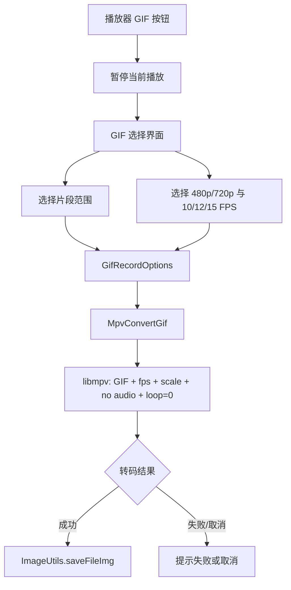

# GIF 录制工程实现记录

> 状态：修复中待真机验证 
> 记录日期：2026-08-07 
> 更新日期：2026-08-08 
> 适用版本：`1.0.0-dev.1` 
> 范围：播放器界面的 GIF 片段选择、GIF 转码和保存；不包含 GIF 编辑、音频、贴纸、文字和分享链路

## 1. 当前结论

已在播放器截图按钮上方增加 GIF 录制入口，并实现二级选择界面：视频预览、片段范围选择、3/5/8/10 秒快捷长度、480p/720p 输出分辨率、10/12/15 FPS、无音频和无限循环提示。确认导出后使用项目已有的 libmpv 转码链路生成 `.gif`，移动端复用 `ImageUtils.saveFileImg` 保存到应用相册，桌面端复用已有文件保存回退。收到用户反馈：iOS 27 Beta 真机上点击导出后立即提示 GIF 转码失败或已取消。此前已切换到包含编码器的 `video-encodersgpl` 构建，但问题仍存在，因此本轮不再把编码器作为唯一根因，改为使用无渲染、软件解码的独立 mpv 转码实例，并修复加载层 Future 生命周期竞态、命令返回值和 GIF 文件头诊断。真机、模拟器和桌面端运行时转码仍待完成验证。

## 2. 背景与任务范围

### 2.1 要解决的问题

用户可以从播放器界面直接截取当前视频附近的短片段，选择长度、输出分辨率和帧率后导出 GIF。入口应位于现有截图按钮上方，并尽量复用现有播放器、画质源选择、转码进度和保存能力。

### 2.2 不解决的问题

- 不录制音频；GIF 输出固定为无限循环。
- 不处理直播流；直播场景的 GIF 按钮不可用。
- 不增加独立下载任务、后台转码队列或 GIF 编辑器。
- 不保证所有视频源都能由当前平台的 libmpv GIF 编码器成功生成；该行为需要运行时验证。

## 3. 依据与现状

| 类型 | 结论 | 依据 |
| --- | --- | --- |
| 已确认 | 播放器已有全屏截图按钮和截图保存链路。 | `lib/plugin/pl_player/view/view.dart` 截图控制区域；`lib/plugin/pl_player/controller.dart` 的 `takeScreenshot` |
| 已确认 | 项目已有 WebP 动态截图使用 libmpv、片段范围和转码进度，可作为 GIF 转码实现基础。 | `lib/plugin/pl_player/view/view.dart` 的 `screenshotWebp`；`lib/plugin/pl_player/widgets/mpv_convert_webp.dart` |
| 已确认 | `ImageUtils.saveFileImg` 移动端调用 `SaverGallery.saveFile`，桌面端调用 `FilePicker.saveFile`。 | `lib/utils/image_utils.dart` |
| 已确认 | 视频详情模型提供多个 DASH 视频源以及宽度信息，可按目标输出宽度选择源。 | `lib/models/video/play/url.dart`；`lib/pages/video/controller.dart` 的 `findVideoByQa` |
| 已确认 | iOS 默认 `media_kit_libs_ios_video` 使用的 libmpv 构建不包含 GIF 视频编码器；`video-encodersgpl` 构建包含 GIF encoder。 | 上游 Darwin build flavor 说明；对两个 iOS artifact 的 `Avcodec.framework` 字符串检查 |
| 候选方向 | 后续可加入视频缩略图时间轴，替代当前 RangeSlider。 | 当前任务只要求类似剪辑软件的范围选择，先复用 Flutter 原生控件降低改动范围。 |
| 已确认 | iOS 依赖已改为本地 `media_kit_libs_ios_video` 包，并在其 Makefile 中固定使用 `video-encodersgpl` artifact 及 SHA256；该依赖本身不能证明运行时转码一定成功。 | `pubspec.yaml` dependency override；`third_party/media_kit_libs_ios_video/ios/Makefile` |
| 已确认 | GIF 转码使用独立、无渲染的 mpv 实例，不应继承播放器的 GPU 渲染和硬件解码配置。 | `lib/plugin/pl_player/widgets/mpv_convert_gif.dart` 转码选项 |
| 待验证 | 当前修复后的 iOS 构建能否在 iOS 27 Beta 真机完成转码并写入相册；用户已反馈其他平台尚未测试。 | 在 iOS 真机执行一次 3 秒、480p、10 FPS 导出，并检查生成文件可被系统相册打开；随后补测 Android、Windows、macOS、Linux。 |

## 4. 技术路线

入口位于 `PLVideoPlayer` 的全屏/桌面画面控制区域，GIF 按钮和截图按钮共用显示条件，GIF 按钮排在截图按钮上方。选择界面使用当前 `VideoController` 显示视频画面，`RangeSlider` 负责选取时间范围，范围最大 10 秒，默认从当前播放位置附近选择 5 秒。确认后根据 480p/720p 目标宽度从 DASH 视频列表选择源，并由 `MpvConvertGif` 进行无音频 GIF 转码。

转码过程中沿用已有 `SmartDialog` 加载层和进度值；成功后调用 `ImageUtils.saveFileImg`。移动端由现有 `SaverGallery` 保存到应用相册路径，桌面端由现有文件选择器让用户选择保存位置。用户取消选择时恢复进入 GIF 界面前的播放状态；导出结束后也恢复原播放状态。

## 5. 实施记录

### 5.1 变更文件

| 文件 | 变更 | 原因 |
| --- | --- | --- |
| `lib/plugin/pl_player/view/view.dart` | 修改 | 增加 GIF 入口、选择流程、视频源选择、转码与保存调用 |
| `lib/plugin/pl_player/widgets/gif_record_dialog.dart` | 新增 | 实现 GIF 二级选择界面和导出选项模型 |
| `lib/plugin/pl_player/widgets/mpv_convert_gif.dart` | 新增 | 封装 libmpv GIF 转码、进度观察和取消清理 |
| `lib/l10n/app_zh.arb` | 修改 | 增加简体中文 GIF 文案 |
| `lib/l10n/app_zh_Hant.arb` | 修改 | 增加繁体中文 GIF 文案 |
| `lib/l10n/app_en.arb` | 修改 | 增加英文 GIF 文案 |
| `lib/l10n/generated/app_localizations*.dart` | 生成更新 | 同步 ARB 消息键 |

### 5.2 关键决策

- **已确认：** 最大片段长度采用 10 秒，默认长度采用 5 秒；快捷选项为 3、5、8、10 秒，若视频不足则按视频长度限制。
- **已确认：** 输出分辨率提供 480p 和 720p；帧率提供 10、12、15 FPS，默认 720p/12 FPS。
- **已确认：** GIF 不包含音频，使用 `loop=0` 输出无限循环 GIF。
- **已确认：** 不新增依赖，复用 `media_kit`/libmpv、`saver_gallery`、`file_picker` 和现有保存工具。
- **候选方向：** 未来可将视频源选择单独展示为“源画质”，目前按输出宽度自动选择最接近且不低于目标宽度的 DASH 源。
- **已确认：** iOS 默认 libmpv artifact 不含 GIF 视频编码器；本地 iOS media_kit 包已切换到 `video-encodersgpl` flavor，并保留 SHA256 校验。
- **已确认：** iOS 27 Beta 真机上的失败发生在导出后立即返回；现场没有可用的 Xcode 控制台日志，因此本轮同时补强 headless mpv 配置、命令错误和输出文件诊断。
- **候选方向：** `vo=gpu` 和硬件解码配置可能使无界面转码实例在 iOS 上初始化失败；本轮不继承播放器的 `hwdec` 配置，改为显式 `vo=null`，让独立实例走软件解码默认路径，待真机验证。
- **已确认：** 加载层先于转码实例启动；保留原始转码 Future，由转码完成任务异步关闭加载层。用户关闭时先 `dispose()`，再等待同一个 Future 收敛，避免 `onDismiss` 和包装 Future 相互等待。
- **待验证：** iOS 真机相册权限与实际导出链路、Android 不同 SDK、桌面文件选择器的 GIF 类型过滤和各平台 GIF 编码器能力需要实际运行确认。

### 5.3 兼容性和风险

- 转码为 CPU 密集型操作，GIF 文件体积可能随分辨率、帧率和片段长度快速增长；界面沿用已有“保存可能需要时间”的加载提示。
- `MpvConvertGif` 通过 libmpv 的 GIF muxer 和 `lavc` GIF 编码器输出；若某个平台构建未带该能力，会进入失败提示路径。
- 保存失败、用户取消桌面保存和文件不存在均由现有 `ImageUtils.saveFileImg` 处理。
- 当前选择界面复用正在播放的 `VideoController`，没有独立预览播放器；关闭对话框后需重点回归播放状态、进度位置和重复打开行为。

## 6. 验证记录

| 层级 | 命令/平台/输入 | 预期 | 实际 | 结果 |
| --- | --- | --- | --- | --- |
| 格式化 | `/Users/husky/Developer/sdk/flutter/bin/dart format lib/plugin/pl_player/view/view.dart lib/plugin/pl_player/widgets/gif_record_dialog.dart lib/plugin/pl_player/widgets/mpv_convert_gif.dart` | 变更 Dart 文件格式化 | 已执行，无格式化错误 | 通过 |
| 静态检查 | `/Users/husky/Developer/sdk/flutter/bin/flutter analyze` | 新增代码无 error | 新增文件和播放器改动无 error；仓库仍有既有 info 级提示 | 通过（无新增 error） |
| 自动化测试 | `/Users/husky/Developer/sdk/flutter/bin/flutter test test/l10n/arb_key_consistency_test.dart` | 三种 ARB 键一致且本地化检查通过 | 10 个测试全部通过 | 通过 |
| iOS 依赖构建 | `make -C third_party/media_kit_libs_ios_video/ios all` | 下载并校验包含 GIF encoder 的 XCFramework | 已下载 `video-encodersgpl` artifact，SHA256 校验通过并完成 XCFramework 解压/符号链接 | 通过 |
| Dart 格式化 | `/Users/husky/Developer/sdk/flutter/bin/dart format lib/plugin/pl_player/widgets/mpv_convert_gif.dart` | 转码实现格式正确 | 已执行，无格式化错误 | 通过 |
| 静态检查（转码实现） | `/Users/husky/Developer/sdk/flutter/bin/flutter analyze lib/plugin/pl_player/widgets/mpv_convert_gif.dart` | 转码实现无 analyzer error | 无问题 | 通过 |
| 依赖解析 | `/Users/husky/Developer/sdk/flutter/bin/flutter pub get` | 依赖解析完成且保留本地 iOS media_kit override | `Got dependencies!`；未更新锁文件 | 通过 |
| CocoaPods | `cd ios && pod install --no-repo-update` | 安装 iOS 依赖并生成 Xcode 工程 | 当前环境 `pod` 命令不可用：`command not found: pod` | 未完成 |
| 差异检查 | `git diff --check` | 无空白错误 | 已执行，无输出 | 通过 |
| 人工回归 | iOS 27 Beta 真机；播放普通 DASH 视频，选择 3 秒、480p、10 FPS 导出 | 不立即失败，生成可播放 GIF 并出现在相册 | 用户反馈此前点击导出后立即失败；本轮 headless/software 修复尚未由本环境重新运行 | 待验证 |
| 人工回归 | Windows/macOS/Linux 桌面；选择同样参数导出 | 文件选择器保存 `.gif`，图片查看器可打开 | 当前环境未运行桌面回归 | 待验证 |

## 7. 遗留问题与下一步

| 问题 | 影响 | 下一步 | 前置条件 |
| --- | --- | --- | --- |
| iOS 27 Beta 真机转码和相册保存尚未回归 | 仍可能存在平台集成、权限或保存链路问题 | 使用 `vo=null` 和软件解码配置执行最小参数 GIF 导出，检查 `GifConvert` 日志、mpv 错误文本、文件头和相册 | 可运行的 iOS 真机构建、CocoaPods |
| 其他平台尚未测试 | 可能存在各平台 libmpv 编码能力或保存行为差异 | 在 Android、Windows、macOS、Linux 分别导出最小参数 GIF | 可运行的目标平台构建 |
| 当前视频预览复用播放器控制器 | 可能影响暂停、seek 和关闭后的播放状态 | 回归打开/取消/导出/重复打开四条路径 | 真实视频播放环境 |
| 相册权限与 GIF 媒体类型未做专项回归 | 可能保存成功但相册不展示，或触发权限提示 | Android 低 SDK、Android 29+、iOS 新旧照片权限分别验证 | 设备和系统权限状态 |
| `docs/` 当前被 `.gitignore` 忽略 | 工程记录默认不会进入 Git 变更 | 由项目负责人决定是否调整忽略策略或单独纳入文档 | 项目负责人确认 |

## 8. 更新记录

- 2026-08-07：创建 GIF 录制实现记录；记录播放器入口、范围选择、libmpv GIF 转码、相册/桌面保存和待验证平台风险。
- 2026-08-08：记录 iOS 转码失败反馈，确认默认 iOS libmpv 缺少 GIF encoder；新增本地 iOS media_kit 依赖并切换到 `video-encodersgpl` artifact，增强转码失败/取消和输出文件校验；记录 CocoaPods 与真机回归限制。
- 2026-08-08：用户反馈 iOS 27 Beta 真机点击导出后仍立即失败；调整排查方向，移除 GIF 转码实例的 GPU/硬件解码继承，显式使用 `vo=null`，增加命令返回值、mpv 错误文本、输出 GIF 文件头诊断，并修复加载层与转码 Future 的生命周期竞态。
- 2026-08-08：补充取消初始化竞态保护：如果用户在独立 mpv 实例创建完成前关闭加载层，创建完成后立即释放 native context；同时让加载层先显示再启动转码，避免立即失败时自动关闭发生在加载层注册之前。
