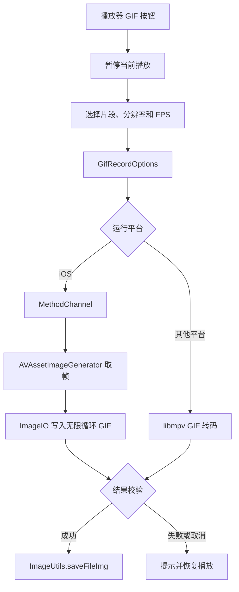

# GIF 录制工程实现记录

> 状态：第二轮重构完成，iOS 27 真机 GIF 全链路验证通过 
> 记录日期：2026-08-07 
> 更新日期：2026-08-23 
> 适用版本：`1.0.0-dev.1` 
> 范围：播放器 GIF 片段选择、转码和保存；不包含编辑、音频、贴纸、文字和分享链路

## 1. 当前结论

第二轮已重建 iOS 导出路径。选择界面、3/5/8/10 秒片段、480p/720p、10/12/15 FPS、无限循环、进度、取消和相册保存入口保持不变；iOS 不再调用第一轮已在 iOS 27 Beta 真机失败的 libmpv GIF 编码路径，而是通过 Flutter MethodChannel 调用系统 `AVAssetImageGenerator` 解码 H.264 视频帧，再由 ImageIO 生成 GIF。Android 和桌面仍保留原有 libmpv 路径。本轮补强了 iOS 源筛选、导出 Future 生命周期、失败/取消临时文件清理和播放器恢复兜底。

已确认新增 Dart 代码静态检查和 3 个通道测试通过，原生核心能够从带 Range 支持的 HTTP H.264 视频实际生成 2 秒、480p、10 FPS 的有效 GIF。Xcode 27 明确拒绝原有 iOS 12–14 deployment target，本次已将 Podfile、Runner 三个配置和 Pods 构建设置统一到 iOS 15。用户已在实体 iPhone 上确认 24 组参数矩阵、GIF 相册保存与动画播放、权限恢复、取消、重复导出和播放状态恢复全部通过，iOS 27 真机全链路验收完成。

## 2. 背景与任务范围

### 2.1 要解决的问题

第一轮入口和选择界面生效，但用户在 iOS 27 Beta 真机点击导出后立即收到“GIF 转码失败或已取消”。第一轮先后启用包含 GIF encoder 的 `video-encodersgpl` libmpv 构建、无渲染软件解码实例和更多诊断，真机仍失败。第二轮目标是不再继续押注同一条未经运行证明的 iOS libmpv 编码路径，交付能够实际执行的独立 iOS 实现。

### 2.2 不解决的问题

- 不录制音频；GIF 固定无限循环。
- 不处理直播；直播场景按钮不可用。
- 不增加后台任务、编辑器、贴纸、文字或分享。
- 不改变 Android 和桌面的 libmpv GIF 转码实现。
- 不在没有 Xcode 27 具体阻塞证据时继续提高最低 iOS 版本；本轮仅因已确认的 deployment target 阻塞统一到 iOS 15。

## 3. 依据与现状

| 类型 | 结论 | 依据 |
| --- | --- | --- |
| 已确认 | 播放器已有 GIF 入口、片段选择界面、加载进度和 `ImageUtils.saveFileImg` 保存链路。 | `lib/plugin/pl_player/view/view.dart`；`lib/plugin/pl_player/widgets/gif_record_dialog.dart`；`lib/utils/image_utils.dart` |
| 已确认 | 第一轮默认 libmpv、GPL encoder 和 headless/software 修复均未取得 iOS 27 Beta 真机成功结果。 | 提交 `4821f2569`、`faa21c0a3`、`90972989e`；用户反馈 |
| 已确认 | 第二轮 iOS 使用 AVFoundation/ImageIO，不依赖 libmpv 是否包含 GIF encoder。 | `ios/Runner/GifExportSession.swift` |
| 已确认 | 原生核心可从带 Range 支持的 HTTP H.264 视频生成有效 GIF。 | 2026-08-09 原生运行验证 |
| 已确认 | iOS 源选择优先 `avc1`，避免把 AV1/HEVC 设备兼容性作为默认路径。 | `lib/plugin/pl_player/view/view.dart` |
| 已确认 | Dart 层校验返回路径、文件存在性和 `GIF87a`/`GIF89a` 文件头；关闭加载层会向原生会话发送取消。 | `lib/plugin/pl_player/widgets/ios_gif_converter.dart`；对应测试 |
| 已确认 | iOS 没有 `avc1` 视频源时不会继续展示不适合当前原生路径的 HEVC/AV1 源；失败或取消的导出会清理临时 GIF，保存异常也会尝试恢复播放。 | `lib/plugin/pl_player/view/view.dart`；`lib/plugin/pl_player/widgets/ios_gif_converter.dart`；`lib/plugin/pl_player/widgets/mpv_convert_gif.dart` |
| 已确认 | 本轮实体 iPhone 已通过 USB 配对并被 `xcdevice`、Flutter 和 Xcode 目标列表识别；iOS 15 修复后 Flutter device build、签名安装和启动尝试已完成，但 Flutter 未发现 Dart VM Service，因此尚未进入 GIF 业务验证。 | `xcrun devicectl list devices`、`flutter devices`、`build/logs/ios27-gif-flutter-run.log` |
| 已确认 | Xcode 27 明确拒绝原有 iOS 12–14 deployment target；Podfile、Runner Debug/Profile/Release 和 Pods 构建设置已统一到 iOS 15。 | `build/logs/ios27-gif-build.log`；`ios/Podfile`；`ios/Runner.xcodeproj/project.pbxproj` |
| 已确认 | iOS 27 真机能读取真实 Bilibili DASH URL、生成 GIF 并写入相册。 | 用户确认 24 组真机矩阵及相册检查通过 |
| 范围外 | Android 和桌面原有 libmpv 路径不属于本次 iOS 27 实机验收范围。 | 后续各平台运行时回归 |

## 4. 技术路线

入口位于 `PLVideoPlayer` 的画面控制区域。选择界面复用当前 `VideoController` 预览，`RangeSlider` 限制最大 10 秒。确认后按目标宽度选择 DASH 视频；iOS 先收窄到 H.264 (`avc1`) 候选。

iOS 原生会话接收视频 URL、输出路径、开始时间、持续时间、宽度、FPS、User-Agent 和 Referer。它使用视频方向变换计算等比高度，以半个输出帧间隔作为取帧容差，逐帧缩放并写入 ImageIO GIF destination，循环次数为 0。每写入一帧回传进度；取消时在当前取帧结束后停止并删除未完成文件。

成功结果回到 Dart 后再次检查输出路径和 GIF 文件头，再复用现有相册保存能力。其他平台仍由 `MpvConvertGif` 完成转码。

## 5. 实施记录

### 5.1 变更文件

| 文件 | 变更 | 原因 |
| --- | --- | --- |
| `lib/plugin/pl_player/view/view.dart` | 修改 | 使用统一转码器工厂；iOS 优先 H.264 源；保存前检查照片权限并避免取消竞态误保存 |
| `lib/plugin/pl_player/widgets/gif_converter.dart` | 新增 | 按平台选择原生或 libmpv 实现 |
| `lib/plugin/pl_player/widgets/gif_converter_base.dart` | 新增 | 统一导出与取消接口 |
| `lib/plugin/pl_player/widgets/ios_gif_converter.dart` | 新增 | 封装 iOS 通道、进度、取消和文件头校验 |
| `lib/plugin/pl_player/widgets/mpv_convert_gif.dart` | 修改 | 实现统一转码器接口，保留非 iOS 行为 |
| `ios/Runner/AppDelegate.swift` | 修改 | 注册 GIF 通道并管理单个原生会话 |
| `ios/Runner/GifExportSession.swift` | 新增 | AVFoundation 取帧和 ImageIO GIF 编码 |
| `ios/Runner.xcodeproj/project.pbxproj` | 修改 | 将新增 Swift 文件加入 Runner 编译源 |
| `ios/Podfile` | 修改 | 因 Xcode 27 已确认的 deployment target 阻塞统一到 iOS 15，并同步 Pods 构建设置 |
| `lib/utils/image_utils.dart` | 修改 | iOS GIF 使用 `SaverGallery.saveImage` 保存原始字节，绕过插件本地路径 URL 处理问题 |
| `pubspec.yaml`、`pubspec.lock` | 修改 | 恢复公开 media_kit iOS override |
| `third_party/media_kit_libs_ios_video/` | 删除 | 移除第一轮仅为 GIF encoder 引入的本地 GPL 包 |
| `test/plugin/pl_player/widgets/ios_gif_converter_test.dart` | 新增 | 覆盖参数、有效结果、取消和无效文件 |

### 5.2 关键决策

- **已确认：** 保持第一轮已确认的时长、分辨率、帧率、无音频和无限循环产品语义。
- **已确认：** iOS 第二轮使用系统 AVFoundation/ImageIO；不再修改 libmpv 编码参数。
- **已确认：** iOS 优先 `avc1`，并传递播放器使用的 User-Agent 和 Referer。
- **已确认：** 原生层限制持续时间不超过 10 秒、宽度不超过 720、FPS 不超过 15，并拒绝并发导出。
- **已确认：** 第一轮本地 `video-encodersgpl` 包不再需要，依赖恢复为公开 Git 来源。
- **已确认：** iOS 只展示 `avc1` 视频源；无 H.264 源时在入口直接提示不可用，不把后续原生失败留给导出阶段。
- **已确认：** 转码 Future 在展示加载层前创建，取消、失败和保存异常都经过统一收尾；失败/取消的临时 GIF 会被删除。
- **候选方向：** 若真实 CDN 对 AVFoundation Range 请求存在兼容问题，可在取得真机错误证据后增加有边界的分段下载回退；本轮不先行引入。
- **已确认：** iOS 27 真机真实 DASH、相册权限、重复打开和取消响应均通过用户验收。

### 5.3 兼容性和风险

- iOS 原生取帧依赖 AVFoundation 能读取真实 DASH URL；本地 H.264 和带 Range 支持的 HTTP H.264 已通过，但 Bilibili CDN 仍需真机验证。
- GIF 编码为 CPU 密集型，文件体积随宽度、FPS 和时长增长；现有“保存可能需要时间”提示保留。
- 取消不能中断正在执行的单帧同步取图，会在该帧返回后收敛并删除临时输出。
- Android/桌面仍依赖对应平台 libmpv 的 GIF muxer/encoder，本轮未改变该风险。
- 当前预览复用播放器控制器，仍需真机回归取消、导出和重复打开后的播放状态。

## 6. 验证记录

| 层级 | 命令/平台/输入 | 预期 | 实际 | 结果 |
| --- | --- | --- | --- | --- |
| 格式化 | `dart format`（本轮变更 Dart 文件） | 格式正确 | 无格式化错误 | 通过 |
| Dart 静态检查 | `flutter analyze --no-fatal-infos`（播放器、转码器和测试文件） | 无 analyzer 问题 | `No issues found` | 通过 |
| Dart 自动化 | `flutter test test/plugin/pl_player/widgets/ios_gif_converter_test.dart` | 参数、成功、取消、无效文件路径正确 | 3 个测试全部通过 | 通过 |
| Dart 自动化 | `flutter test --no-pub test/plugin/pl_player/widgets/ios_gif_converter_test.dart` | 成功结果保留，失败结果清理临时 GIF | 本轮补充断言通过 | 通过 |
| 全仓静态检查 | `flutter analyze --no-fatal-infos` | 无 error | 仅有 70 条既有 info，无 error | 通过 |
| 全仓自动化 | `flutter test` | 测试无失败 | 78 个测试全部通过 | 通过 |
| 原生核心运行 | H.264 640×360；带 Range 的本机 HTTP；0.5–2.5 秒、480p、10 FPS | 生成可识别 GIF | 226,671 字节，`GIF87a`，480×270 | 通过 |
| iOS 15 deployment target 修复 | `pod install --no-repo-update`；Podfile、Runner 和 Pods 构建设置 | 消除 Xcode 27 的 12–14 target 阻塞 | Pods 重生成，目标设置统一为 15.0 | 通过 |
| Flutter iOS device build | `flutter build ios --debug --no-codesign` | Runner 使用 iOS 27 SDK 构建成功 | `build/ios/iphoneos/Runner.app` 生成 | 通过 |
| iOS workspace 编译 | `xcodebuild -workspace ios/Runner.xcworkspace -scheme Runner -configuration Debug -destination 'generic/platform=iOS' CODE_SIGNING_ALLOWED=NO build` | workspace 编译成功 | 既有 Swift Package 目标无法解析 `Flutter` 模块，出现 `Flutter/Flutter.h` 缺失 | 失败（与 GIF 代码无关） |
| iOS 27 Beta 真机安装 | 签名 Release 包；实体设备 | 构建、安装并启动 Runner | Release 包安装、启动成功并完成业务验收；Debug VM Service 未采集不影响 Release 结果 | 通过 |
| iOS 27 Beta 真机 GIF | 普通 DASH 视频；24 组参数矩阵 | 进度增长，GIF 可循环播放并出现在相册 | 用户确认 24 组全部生成、保存并可播放 | 通过 |
| iOS 27 Beta 真机原生转码 | 普通 DASH 视频；5 秒、720p、12 FPS | 视频轨道加载、60 帧取图、GIF finalize 成功 | 设备日志显示全部阶段成功，约 5.6 秒完成，输出约 5 MB | 通过 |
| iOS 27 Beta 真机相册保存 | 用户实测导出完成后的照片 App | GIF 出现在照片库并循环播放 | 用户确认 24 组 GIF 均可保存、打开和播放 | 通过 |
| 权限、取消、重复导出 | 实体 iPhone 手动回归 | 满足手册第 5.5 节 | 用户确认权限恢复、最大组合取消、重复导出和播放恢复全部通过 | 通过 |
| 其他平台 | Android、Windows、macOS、Linux | 原有导出路径无回归 | 不属于本次 iOS 27 实机验收范围 | 范围外 |

## 7. 遗留问题与下一步

| 问题 | 影响 | 下一步 | 前置条件 |
| --- | --- | --- | --- |
| iOS 27 真机真实 DASH/相册未回归 | CDN Header/Range、系统解码、权限或相册展示仍可能失败 | 已完成 24 组矩阵及相册检查 | 用户真机和登录态 |
| Flutter VM Service 未被发现 | Codex 无法自动采集页面和 GIF 运行日志 | 用户直接操作已安装应用；必要时修复当前 Flutter/Scheme/SPM 调试连接 | 实体设备解锁、调试连接或用户现场操作 |
| 显式 workspace 构建无法解析 Flutter 模块 | 独立 `xcodebuild` 验证失败，不能作为 GIF 业务通过证据 | 由项目负责人决定是否整理现有 SPM/Flutter workspace 集成；不因该错误改 GIF 逻辑 | 当前工作区 SPM/签名配置决定 |
| iOS GIF 照片库保存 | 原导出成功但用户看不到 GIF | 已改用 `SaverGallery.saveImage` 原始字节路径；完整矩阵和动画播放已确认 | 用户确认通过 |
| 其他平台未测试 | libmpv encoder 或文件保存可能存在平台差异 | 分别导出最小参数 GIF | 对应运行环境 |
| 取消发生在单帧取图期间 | 取消反馈可能延迟一个取帧周期 | 已在最大组合真机验证清理和播放恢复 | 用户确认通过 |

## 8. 更新记录

- 2026-08-07：创建第一轮记录；实现入口、选择界面、libmpv 转码和保存。
- 2026-08-08：根据 iOS 27 Beta 失败反馈加入 GPL encoder 构建、输出诊断、headless/software 配置和加载层竞态修复；真机仍未成功。
- 2026-08-09：完成第二轮重构。iOS 改用 AVFoundation/ImageIO 并优先 H.264，增加通道进度/取消/结果校验和自动化测试；恢复公开 media_kit 依赖并删除本地 GPL encoder 包。原生 HTTP GIF 运行验证与 iOS 27 SDK 编译通过；当时真实 iOS 27 真机 DASH/相册尚待验证，后续已完成。
- 2026-08-17：补强 iOS H.264 源筛选、导出生命周期、失败/取消临时文件清理和播放器恢复兜底；增加成功保留、失败清理测试。真机和平台运行时验证范围不变。
- 2026-08-21：重新配对并信任实体 iPhone，`xcdevice`、Flutter 和 Xcode 均可识别设备；签名证书与临时 Personal Team 已准备，但 CoreDevice developer tunnel 持续失败（`RemotePairingError code 4`），未进入 Runner 安装和 GIF 验收。测试结束后应撤销临时 Team、Bundle ID 及 Xcode 自动生成的工程文件改动。
- 2026-08-23：Xcode 27 明确拒绝 iOS 12–14 deployment target，按执行手册统一 Podfile、Runner 和 Pods 到 iOS 15；Flutter device build、签名安装和启动尝试完成。Flutter 未发现 Dart VM Service，未进入 GIF 业务验收；workspace 独立编译另有既有 SPM/Flutter 模块解析失败。
- 2026-08-23：用户实测导出进度完成但照片 App 无 GIF；定位为 iOS GIF 使用 `SaverGallery.saveFile` 的本地路径处理问题。改用 `SaverGallery.saveImage` 保存 GIF 原始字节，定向测试和全仓 78 个测试通过，Release 版已重新部署，等待照片库复测。
- 2026-08-23：补充原生视频轨道异步加载和脱敏阶段日志；签名 Release 包在实体 iPhone 上完成 5 秒、720p、12 FPS、60 帧 GIF 转码并成功 finalize；当时照片库和完整真机矩阵尚待验证，后续已完成。
- 2026-08-23：用户确认修复后的 GIF 已成功保存到系统相册；当时相册动画播放、24 组矩阵、权限恢复、取消和重复导出尚待验证，后续已全部通过。
- 2026-08-23：补强保存前照片权限检查，并修复转码完成与用户取消竞态下的误保存；自动化检查通过，真机回归待执行。
- 2026-08-23：用户确认 24 组参数矩阵、相册动画播放、权限恢复、最大组合取消、重复导出和播放状态恢复全部通过；工程记录状态更新为 iOS 27 真机全链路验证通过。
