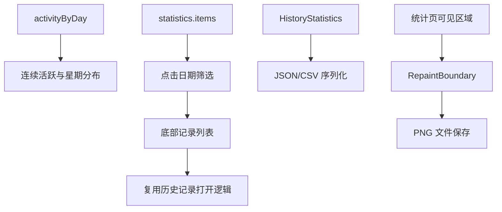

# 数据统计 Beta 4 工程实现记录

> 状态：已实现，自动化验证通过，设备/桌面人工回归待执行 
> 记录日期：2026-08-05 
> 更新日期：2026-08-05 
> 适用版本：`1.0.0-dev.1` / `main` 
> 范围：在 Beta 3 统计页基础上增加日期记录查看、连续活跃统计、星期分布和 JSON/CSV/截图导出；不改变历史记录查询接口和持久化格式。

## 1. 当前结论

本轮已完成“数据统计 Beta 4”业务代码和三语界面文案。统计页标题更新为 Beta 4；用户可以点击活跃日期查看当前已加载记录，可以看到当前/最长连续活跃天数和星期分布，并从右上角导出 JSON、CSV 或当前统计页可见区域截图。自动化测试、格式化和差异检查已执行；真实账号、移动端文件保存权限、桌面文件选择器和截图视觉效果仍需人工回归。

## 2. 背景与任务范围

### 2.1 要解决的问题

Beta 3 已经能够以实际活动日期的最早和最晚边界展示日历，但日期单元格没有进一步操作；统计页也缺少连续活跃习惯、星期分布和可携带的数据输出。本轮补齐这些小功能，保持现有统计模型和记录查询边界。

### 2.2 不解决的问题

- 不新增历史搜索接口或日期查询接口；日期详情只筛选统计页已经加载的记录。
- 不承诺导出包含账号全部历史。当前数据仍受 Bilibili 可查询记录和本次加载上限影响。
- 不生成复杂的分享海报；图片导出暂时是统计页当前可见区域的 PNG 截图。
- 不把 `progress`、`view_at` 或剩余时长解释为真实观看时长。
- 不修改历史记录持久化格式、查询分页策略或视频打开路由。

## 3. 依据与现状

| 类型 | 结论 | 依据 |
| --- | --- | --- |
| 已确认 | 统计页由 `HistoryStatisticsPage`、`HistoryStatisticsContent` 和 `HistoryStatisticsCalculator` 组成，统计数据来自当前加载的历史记录。 | `lib/pages/history_stats/view.dart`、`lib/pages/history_stats/statistics.dart` |
| 已确认 | 当前历史记录加载最多保留 `HistoryStatistics.recordLimit`（1200）条，并可能标记为部分数据。 | `lib/pages/history_stats/controller.dart:15-93` |
| 已确认 | `HistoryItemNavigation.open(context, item)` 是现有历史记录打开逻辑。 | `lib/pages/history/open_item.dart:7-58` |
| 已确认 | 项目已有 `StorageUtils.saveBytes2File`，可将字节保存为用户选择的文件。 | `lib/utils/storage_utils.dart:8-35` |
| 已确认 | Flutter 原生 `RepaintBoundary` 可用于把当前统计页可见区域转成 PNG。 | `lib/pages/history_stats/view.dart` 的 Beta 4 实现 |
| 候选方向 | 未来可以增加日期范围筛选、完整历史查询或可分享的排版海报。 | 本轮不扩大范围，需另行确认产品交互和接口能力 |
| 待验证 | Android/iOS 权限、桌面文件选择器和真实设备上的截图尺寸与视觉效果。 | 需要目标平台人工回归 |

## 4. 技术路线

### 4.1 统计计算

`HistoryStatistics` 在已有 `activityByDay` 基础上提供三个计算 getter：

- `currentActiveStreak`：按已加载数据中最晚活动日期结束的连续日期段长度；它代表当前可检测活动段，不推断查询范围之外的日期。
- `longestActiveStreak`：已加载日期中的最长连续活动段。
- `weekdayCounts`：按星期一至星期日，将每日活动记录数累加分组。

这些值不增加构造参数，也不写入本地存储；`withUploaderAvatars` 保持原有不可变统计对象的复制行为。

### 4.2 日期详情

活跃日期日历将日期点击回调传入 `_ActivityDayCell`。点击后从 `statistics.items` 按本地日期筛选记录，弹出底部列表，显示日期、数量、封面、标题和作者/业务信息；点击列表项复用 `HistoryItemNavigation.open`。因此日期详情与当前统计结果保持一致，不额外请求网络。

### 4.3 导出与截图

新增 `HistoryStatisticsExport` 纯逻辑序列化工具：

- JSON：包含导出版本、导出时间、统计范围、数据源状态、汇总指标、星期/小时分布、每日活动、内容分组、UP 主排行和当前已加载记录。
- CSV：包含当前已加载记录的日期、标题、业务类型、内容类型、分区、UP 主、进度、时长、是否看完和是否收藏；使用 UTF-8 BOM 兼容常见表格软件。
- PNG：在统计页成功加载后，用 `RepaintBoundary` 捕获当前统计内容区域并保存为 PNG。

## 5. 实施记录

### 5.1 变更文件

| 文件 | 变更 | 原因 |
| --- | --- | --- |
| `lib/pages/history_stats/statistics.dart` | 新增连续活跃和星期分布 getter。 | 支持 Beta 4 的统计指标 |
| `lib/pages/history_stats/view.dart` | 更新 Beta 4 页面交互、导出菜单、截图边界、日期详情底部列表、连续活跃卡片和星期柱状图。 | 支持四项新功能 |
| `lib/pages/history_stats/export.dart` | 新增 JSON/CSV 字节序列化。 | 将当前统计数据导出为文件 |
| `lib/l10n/app_zh.arb` | 更新 Beta 4 标题并新增简体中文文案。 | 保持界面本地化 |
| `lib/l10n/app_zh_Hant.arb` | 更新 Beta 4 标题并新增繁体中文文案。 | 保持界面本地化 |
| `lib/l10n/app_en.arb` | 更新 Beta 4 标题并新增英文文案及单复数记录文案。 | 保持界面本地化 |
| `lib/l10n/generated/app_localizations*.dart` | 重新生成本地化输出。 | 保持生成文件与 ARB 同步 |
| `test/pages/history_stats/statistics_test.dart` | 覆盖空数据、连续活跃和星期分布。 | 防止统计计算回归 |
| `test/pages/history_stats/export_test.dart` | 覆盖 JSON 字段、CSV BOM 和字段转义。 | 验证导出格式 |
| `test/pages/history_stats/view_test.dart` | 覆盖日期点击底部记录列表和紧凑布局。 | 验证交互与三语布局 |
| `test/l10n/arb_key_consistency_test.dart` | 更新 Beta 4 标题版本断言。 | 防止三语标题不一致 |
| `docs/engineering/history-statistics-beta4.md` | 新建本记录。 | 记录实现、边界和验证结果 |

### 5.2 关键决策

- **已确认：** 日期详情只使用当前 `statistics.items`，避免引入未经确认的历史日期 API 参数。
- **已确认：** 连续活跃统计基于可检测日期键，最新连续段作为“当前连续活跃”，最长日期段作为“最长连续活跃”。
- **已确认：** 导出文件只表达当前已加载数据，并在 JSON 中保留 `reachedRecordLimit` 和 `isPartial` 状态。
- **已确认：** 图片导出先实现当前统计内容区域截图，不增加图片编辑或分享海报依赖。
- **候选方向：** 导出时增加分享按钮、导出完整活动日历或生成专用海报。
- **待验证：** 不同设备像素比、动态字体和文件系统权限下的截图/保存效果。

### 5.3 兼容性和风险

- 日期底部列表的记录数量受当前统计页加载结果影响；当数据达到 1200 条上限或部分加载失败时，列表可能不是账号全部历史。
- 连续活跃统计无法识别当前加载范围之外的缺失日期，尤其是在记录被截断或部分加载时，应结合页面的数据源提示理解。
- 截图只捕获统计页可见区域，不包含 AppBar 外层，也不会自动滚动采集整页；这是本轮“先做截图”的明确范围。
- 文件保存依赖现有 `file_picker` 和平台文件能力；移动端取消、权限或系统拒绝时沿用 `StorageUtils` 的提示。
- 日期列表中的内容打开仍复用原有路由和网络补充逻辑；真实账号下的不可用内容、直播状态和缺失 `cid` 仍按原有逻辑处理。

## 6. 验证记录

| 层级 | 命令/平台/输入 | 预期 | 实际 | 结果 |
| --- | --- | --- | --- | --- |
| 格式化 | `/Users/husky/Developer/sdk/flutter/bin/dart format lib/pages/history_stats/statistics.dart lib/pages/history_stats/view.dart lib/pages/history_stats/export.dart test/pages/history_stats/statistics_test.dart test/pages/history_stats/export_test.dart test/pages/history_stats/view_test.dart test/l10n/arb_key_consistency_test.dart` | 变更 Dart 文件格式正确 | 命令退出 0 | 通过 |
| 本地化生成 | `/Users/husky/Developer/sdk/flutter/bin/flutter gen-l10n` | 三份 ARB 与生成输出同步 | 命令退出 0，Beta 4 文案已生成 | 通过 |
| 定向测试 | `/Users/husky/Developer/sdk/flutter/bin/flutter test test/pages/history_stats/statistics_test.dart test/pages/history_stats/export_test.dart test/pages/history_stats/view_test.dart test/l10n/arb_key_consistency_test.dart` | 统计、导出、日期点击、布局和标题测试通过 | 27 项通过 | 通过 |
| 全量测试 | `/Users/husky/Developer/sdk/flutter/bin/flutter test` | 全仓测试通过 | 62 项通过 | 通过 |
| 静态检查 | `/Users/husky/Developer/sdk/flutter/bin/flutter analyze`；统计相关文件定向 analyze | 无新增错误 | 全量 analyze 保持仓库既有 70 条 info 级提示；统计相关文件定向 analyze 无问题 | 通过（存在既有 info） |
| 差异检查 | `git diff --check` | 无空白错误 | 无输出 | 通过 |
| 人工回归 | Android、iOS、Windows/macOS/Linux 统计页 | 核对导出文件、截图、日期列表和长跨度布局 | 未运行 | 待验证 |

## 7. 遗留问题与下一步

| 问题 | 影响 | 下一步 | 前置条件 |
| --- | --- | --- | --- |
| 尚未在真实设备/桌面运行导出 | 无法确认各平台保存位置、权限和文件选择器体验 | 分别执行 JSON、CSV、PNG 保存并打开文件校验 | 可用设备或桌面构建环境 |
| 截图只覆盖当前可见区域 | 长页面无法一次导出完整统计内容 | 若需要完整长图，再确认滚动拼接或专用海报需求 | 产品负责人确认 |
| 连续活跃受可查询历史边界影响 | 截断/部分数据时不能代表完整账号历史 | 保留数据源提示，后续再考虑完整历史策略 | 接口能力和产品文案确认 |

## 8. 更新记录

- 2026-08-05：创建 Beta 4 工程记录；完成日期详情、连续活跃、星期分布、JSON/CSV/PNG 截图导出、三语文案、自动化测试和实现边界记录。
