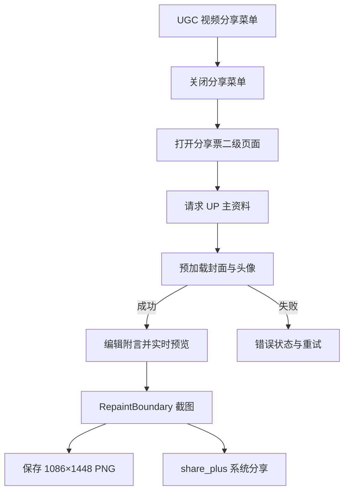

# 分享票工程实现记录

> 状态：已实现，待设备与桌面人工回归 
> 记录日期：2026-08-05 
> 更新日期：2026-08-09 
> 适用版本：`1.0.0-dev.1`，`main` 
> 范围：仅包含 UGC BV 视频的分享票入口、编辑/预览、PNG 生成、保存和系统分享；不包含番剧/PGC、音频、本地视频和私信分享逻辑

## 1. 当前结论

分享票第二版 B 已完成：页面使用 ImageGen 生成的 `share_ticket_v2_terminal.png` 作为固定 1086×1448 Terminal Cut 背景，通过 Flutter `Stack` 精确绘制品牌/BV、视频封面、标题、UP 主、统计、附言、二维码、来源、分享者和视频链接。主票区承载视频内容，浅色副券区承载扫码与分享身份；保存、系统分享、错误重试和匿名分享行为保持不变。第一版 `share2.png` 已移出应用资源包，本轮没有增加主题切换，也没有修改 PGC、音频、本地视频或私信分享入口。

业务代码已修改；Android、iOS、Windows、macOS、Linux 真机/桌面人工回归尚未在本环境完成。

## 2. 背景与任务范围

### 2.1 要解决的问题

用户在 UGC 视频分享菜单中需要一种基于固定票据模板的视觉化分享方式。第一版功能链路已完成，但仿古宣纸背景与现代视频封面、Material 图标、二维码和 ExPiliPlus 品牌语言不一致。第二版在不改变数据和分享行为的前提下重建固定画布视觉。

### 2.2 不解决的问题

- 不为番剧/PGC、音频、本地视频增加分享票入口。
- 不替换既有视频文本分享、动态转发、私信分享或外部链接逻辑。
- 不在应用运行时调用生图服务；第二版底图仅在开发阶段使用内置 ImageGen 生成，不新增运行时图片处理或网络依赖。
- 不增加第一版/第二版主题切换或新的持久化设置。
- 不在本轮承诺所有平台的相册权限、文件选择器和系统分享面板已通过人工回归。

## 3. 依据与现状

| 类型 | 结论 | 依据 |
| --- | --- | --- |
| 已确认 | UGC 分享菜单由 `UgcIntroController.actionShareVideo` 构造，本轮入口只加入此处。 | `lib/pages/video/introduction/ugc/controller.dart` |
| 已确认 | 视频详情已经提供 BV、封面、标题、发布时间、时长、UP 主和统计字段；分享票右上角展示视频时长而非分享时间。 | `lib/models_new/video/video_detail/data.dart`、`lib/models/model_owner.dart`、`lib/services/share_ticket_service.dart` |
| 已确认 | UP 主等级和头像由现有 `MemberHttp.memberInfo` 补充，当前用户来自 `Pref.userInfoCache`。 | `lib/http/member.dart`、`lib/utils/storage_pref.dart` |
| 已确认 | 第二版 B 采用用户确认的 Terminal Cut 方向；背景为 1086×1448 RGB PNG，由内置 ImageGen 在开发阶段生成。 | `assets/images/share_ticket/share_ticket_v2_terminal.png`、本轮视觉确认 |
| 已确认 | 第二版为唯一应用内样式，第一版 `share2.png` 不再随应用打包；资源目录声明无需改变。 | `lib/pages/share_ticket/view.dart`、`pubspec.yaml` |
| 已确认 | 二维码内容使用标准视频路径 `https://www.bilibili.com/video/<bvid>`。 | `lib/services/share_ticket_service.dart` |
| 已确认 | 附言输入限制为 100 个 Unicode code point，数据模型和输入框均执行限制。 | `lib/services/share_ticket_service.dart`、`lib/pages/share_ticket/view.dart` |
| 待验证 | 实际远程图片、UP 主资料请求失败时，各平台网络栈是否稳定触发重试状态。 | 需在有网络的设备或桌面环境操作 |
| 待验证 | Android/iOS 相册权限、Windows/macOS/Linux 文件保存路径和系统分享能力。 | 需进行平台人工回归 |
| 已确认 | 长标题、长附言、三项统计、二维码和关键本地化字段已通过 1086×1448 Widget 布局测试；第二版静态预览已由项目负责人确认。 | `test/pages/share_ticket/view_test.dart`、本轮预览图 |
| 待验证 | 不同自定义字体、多分辨率真实封面下的视觉差异与二维码实际扫码识别率。 | 需运行应用导出真实 PNG 并扫码 |

## 4. 技术路线

页面打开后先校验视频详情中的 `owner`、`mid`、`bvid`、封面和标题，再请求 UP 主资料。只有资料和必要图片预加载完成后才进入编辑/预览状态。当前登录用户存在且 `isLogin == true` 时复用缓存身份；没有登录用户时不请求分享者资源，也不阻止生成。

预览和截图使用同一个固定尺寸的 `ShareTicketCanvas`，第二版背景通过 `Image.asset` 加载，内容继续使用 `Positioned`、`ClipRRect`、文字组件、头像和 `PrettyQrView` 叠加。主票区依次排列品牌/BV、16:9 封面、标题、UP 主、三项统计和附言；浅色副券区排列二维码、ExPiliPlus 来源、分享者和标准视频链接。`RepaintBoundary.toImage(pixelRatio: 1)` 仍输出 1086×1448 PNG，二维码和底部链接来自同一个 `videoUrl`/`qrContent` 值，避免内容不一致。

## 5. 实施记录

### 5.1 变更文件

| 文件 | 变更 | 原因 |
| --- | --- | --- |
| `lib/pages/video/introduction/ugc/controller.dart` | 修改 | 加入“分享为分享票”菜单项并打开二级页面 |
| `lib/pages/share_ticket/view.dart` | 修改 | 保留编辑、截图、保存和分享链路，重建第二版固定画布排版与配色 |
| `lib/services/share_ticket_service.dart` | 新增 | 统一封装 BV 链接、视频字段、统计、UP 主和分享者数据 |
| `assets/images/share_ticket/share_ticket_v2_terminal.png` | 新增 | 第二版 B Terminal Cut 背景，由内置 ImageGen 生成并复制到应用资源目录 |
| `assets/images/share_ticket/share2.png` | 删除 | 第一版底图不再引用，移出应用资源包以减少约 2.1 MB |
| `pubspec.yaml` | 修改 | 声明分享票资源目录 |
| `lib/l10n/app_zh.arb` | 修改 | 简体中文分享票文案 |
| `lib/l10n/app_zh_Hant.arb` | 修改 | 繁体中文分享票文案 |
| `lib/l10n/app_en.arb` | 修改 | English 分享票文案 |
| `lib/l10n/generated/app_localizations*.dart` | 更新 | 由 Flutter l10n 生成分享票键的访问器和实现 |
| `test/services/share_ticket_service_test.dart` | 新增 | 数据映射、链接、统计、分享者和附言长度测试 |
| `test/pages/share_ticket/view_test.dart` | 修改 | 覆盖第二版背景、长标题、长附言、统计、二维码、视频链接和布局异常 |
| `test/l10n/arb_key_consistency_test.dart` | 使用现有测试 | 验证三种 ARB 的键集合一致 |

### 5.2 关键决策

- **已确认：** 第一版只从 UGC BV 视频分享菜单进入；标准链接统一使用 `/video/BV...` 路径。
- **已确认：** 第二版 B 采用 Terminal Cut 深色主票＋浅色副券方向，由内置 ImageGen 生成无文字、无 Logo、无二维码的背景，动态内容全部由 Flutter 精确绘制。
- **已确认：** 第二版作为唯一样式，不增加主题切换；第一版底图不再随应用打包。
- **已确认：** 分享票中填充封面、标题、发布时间、UP 主头像/名称/等级、播放/弹幕/点赞、附言、二维码、分享者和 ExPiliPlus 来源文案。
- **已确认：** 动态文案使用简体中文、繁体中文和 English 三份 ARB；统计数值沿用项目现有 `NumUtils.numFormat`，因此会随当前语言使用 `K/M` 或本地化单位。
- **已确认：** 未登录时分享者区域为空；必要远程资源失败时显示错误和重试按钮。
- **候选方向：** 未来如需多主题，可再将坐标和样式抽成配置；本轮不预留用户设置或持久化值。
- **待验证：** 需要在实际平台确认图片保存完成提示、权限申请和系统分享面板行为。

### 5.3 兼容性和风险

- 资源加载依赖 Bilibili 图片和会员资料接口；网络不可用时页面不会生成半成品图片，而是停留在错误/重试状态。
- `MemberHttp.memberInfo` 是现有网络接口，本轮没有新增依赖或替换请求协议；接口字段缺失时按资源失败处理。
- 图片保存复用 `ImageUtils.saveByteImg`，移动端仍遵循既有相册权限策略，桌面端仍使用既有文件选择器。
- 预览使用 `FittedBox` 缩放，截图使用固定尺寸画布；第二版不再根据标题行数移动后续内容，所有区域使用固定网格，长标题和附言以最大行数及省略号收束。
- 第二版背景约 1.8 MB，替换约 2.1 MB 的第一版背景，资源目录声明与截图尺寸保持不变。
- 分享票文字继续使用应用当前字体，因此自定义字体可能改变字宽；长文本自动化测试已通过，但仍需用实际已下载字体导出图片复核。
- 分享者头像为空时只渲染空头像框和空名称，不把未登录视为资源错误。

## 6. 验证记录

| 层级 | 命令/平台/输入 | 预期 | 实际 | 结果 |
| --- | --- | --- | --- | --- |
| 定向测试 | `/Users/husky/Developer/sdk/flutter/bin/flutter test test/services/share_ticket_service_test.dart test/pages/share_ticket/view_test.dart test/l10n/arb_key_consistency_test.dart` | 分享票服务、第二版布局和 ARB 测试通过 | 15 个测试全部通过 | 通过 |
| l10n 生成 | `/Users/husky/Developer/sdk/flutter/bin/flutter gen-l10n` | 生成三语言访问器 | 生成完成，无错误 | 通过 |
| 完整测试 | `/Users/husky/Developer/sdk/flutter/bin/flutter test` | 项目测试通过 | 78 个测试全部通过 | 通过 |
| 定向静态分析 | `/Users/husky/Developer/sdk/flutter/bin/flutter analyze --no-fatal-infos lib/pages/share_ticket/view.dart test/pages/share_ticket/view_test.dart` | 分享票变更无诊断 | `No issues found` | 通过 |
| 完整静态分析 | `/Users/husky/Developer/sdk/flutter/bin/flutter analyze --no-fatal-infos` | 无 error/warning | 仅报告项目既有 70 条 info，没有分享票诊断，命令成功 | 通过（既有 info 保留） |
| 差异检查 | `git diff --check` | 无空白错误 | 通过 | 通过 |
| 资源检查 | `file assets/images/share_ticket/share_ticket_v2_terminal.png` | 第二版背景为 1086×1448 RGB PNG | 与预期一致，约 1.8 MB | 通过 |
| 静态视觉 | 1086×1448 Flutter 预览，长标题、附言、统计和副券区 | 排版符合第二版 B 方向 | 项目负责人已确认当前预览 | 通过 |
| 人工运行时 | Android/iOS/Windows/macOS/Linux | 入口、预览、保存、分享、尺寸和二维码扫码 | 当前环境未执行 | 待验证 |

分享票定向静态分析无诊断；完整静态分析仅保留项目既有 info。自动化测试和静态预览不能替代真实设备保存、系统分享面板及二维码扫码验证。

## 7. 遗留问题与下一步

| 问题 | 影响 | 下一步 | 前置条件 |
| --- | --- | --- | --- |
| 尚未完成真实平台回归 | 无法确认权限、文件路径和系统分享面板 | 在 Android、iOS、Windows、macOS、Linux 分别操作分享票流程 | 对应设备/桌面运行环境 |
| 尚未完成网络异常与重试人工验证 | 无法确认所有网络错误都能友好恢复 | 断网或拦截封面/会员请求，确认重试后可恢复 | 可控网络条件 |
| 尚未完成真实导出二维码扫码 | 自动化只能确认二维码组件和内容存在 | 运行应用导出 1086×1448 PNG，并用另一设备扫码 | 可运行应用与扫码设备 |
| 尚未完成自定义字体组合回归 | 极端字宽可能改变标题和附言的省略位置 | 选取项目支持的宽体/手写字体分别导出并检查 | 已下载对应字体 |

## 8. 更新记录

- 2026-08-05：新增分享票入口、数据服务、模板渲染页面、三语言文案、模板资源和自动化测试；记录当前自动化验证结果及待完成的平台人工回归。
- 2026-08-07：根据视觉反馈将右上角字段改为视频时长；短标题时压缩标题下方留白；底部 ExPiliPlus 来源文案上移并提高可读性；二维码和统计图标风格暂不调整。
- 2026-08-09：完成第二版 B Terminal Cut 视觉重建；加入 ImageGen 背景、固定主票/副券网格和正式长文本 Widget 覆盖，移除第一版应用资源；记录 15 项定向测试、78 项完整测试、静态分析和已确认预览结果。
